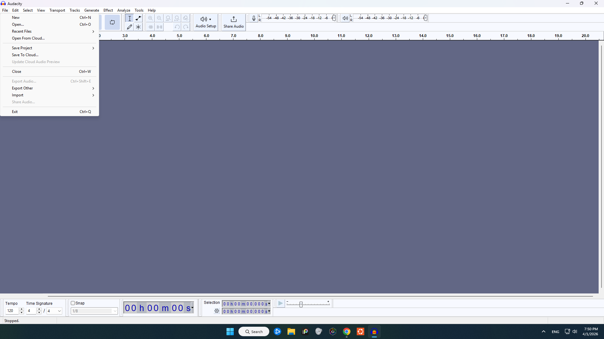
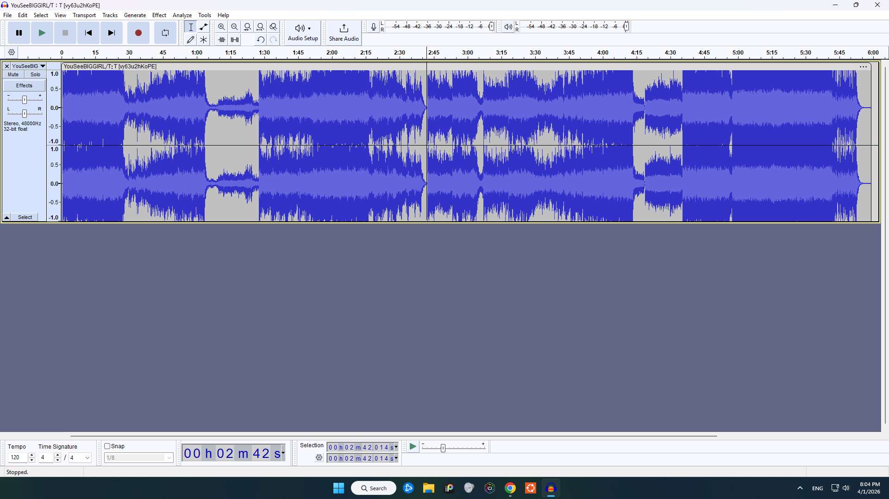
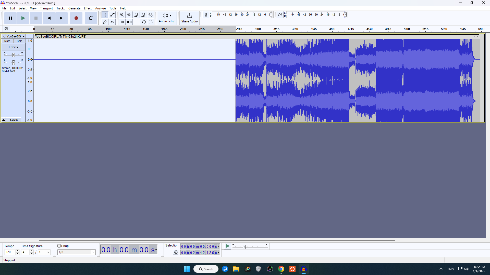
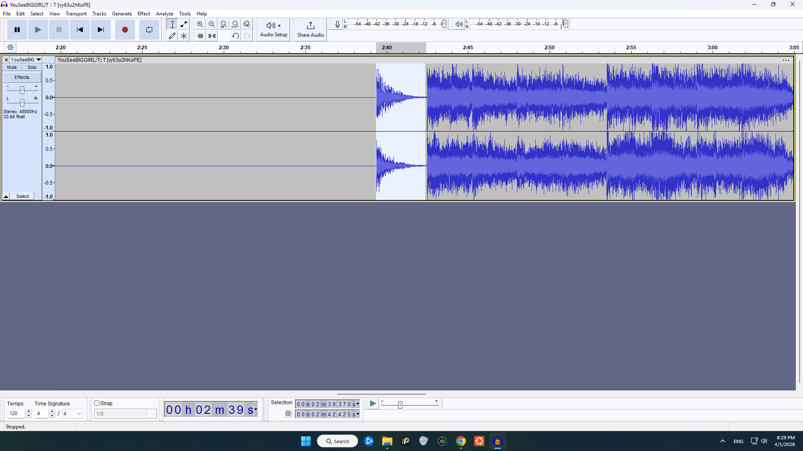
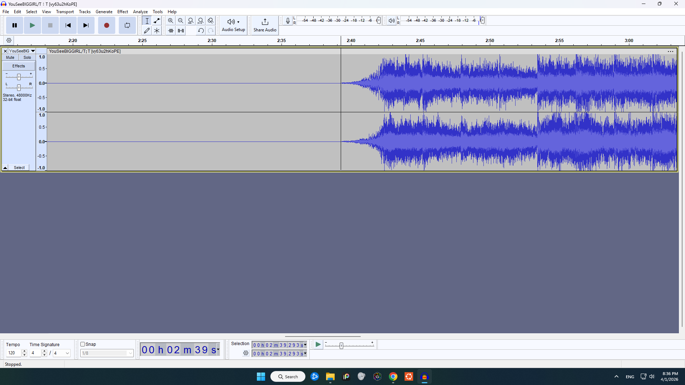

# [ux-ktoledo18](README.md)

---

# Clipping Music

---

There's this song I like that is essentially split into 2 parts. An orchestral intro and the intense emotional vocal part. I could not for the love of me find a clipped version on youtube with only the second half  [YouSeeBIGGIRL](https://www.youtube.com/watch?v=vy63u2hKoPE&pp=ygUQeW91IHNlZSBiaWcgZ2lybA%3D%3D).

I figured I'd have to clip it myself with something other than a cheap phone app because the change is very sudden in the song. Ignoring the struggle of trying to find a way to only download the MP3 from youtube; I chose an app called Audacity that's for music making and I was greeted with this screen to which I quickly navigated to the top left file button.

The first problem I encountered was just getting the song to be uploaded to the app. Do I click "new", "open", "import"? After juggling with these options I discovered that import opens a new menu that has audio as an option. With that I could select and upload the song. As shown below. I suggest the better solution of these having better labels; changing them to "new window", "open project", and "upload" which is what they actually do, this would prevent users becoming confused and opening other things.

Now although I could've just listened through the song to find the spot since I know it's in the middle; the app demonstrates a great usability principle of **match between system and the real world** which is designing interfaces that use familiar words, symbols, and layouts so users can understand and use them easily. The waveform is a good representation of sound over time, where louder sections appear larger and quieter sections smaller. Even without experience, this made it easy to identify where the intro ended and the main portion of the song began around 2 mins 45 secs.

I very much appreciated how selecting and deleting matched my **mental model** of how I expected it to work. Similar to a word doc, which has the **common conventions** of just clicking and dragging then hitting backspace! There's also a very clear magnifying glass button to zoom in and get a more precise selection!

However now as you can tell it looks quite abrupt... And it sounds like it too, it feels like it starts out of nowhere. This is no fault of the app but I was thinking I could fade the audio in somehow. Again just like a word doc I could hit ctrl+z and bring back what I deleted. This allowed me to **recover from error** and  try again.

Now my thought was maybe I could get the selected portion right before the second half which is a bass drum strike and reverse it and have it start quiet then slowly get louder. This way the drum would start quiet and get loud back to where it was struck. How would I do this though?

To me finding the reverse effect was very hard, there's a clear effects button on the top; however, it's littered with overwhelming options, fading wasn't hard to find, as it's one of the main options but I'd expect a time option that would have things like reverse, slow down, speed up, etc. The **conceptual model** of how the interaction actually worked was not what I was expecting. It was actually in a section called "special" which to me seemed wrong, reversing isn't that niche to warrant it being considered special. Nonetheless I applied the effect and it worked great!

As you can see it looks amazing and no longer abrupt! Due to the nature of the bass drum and its echo, I didn't even need the fading effect. It sounded perfect! From then on, saving the audio was not hard as I was used to saving files on many apps before.

I suggest this app a better solution of labeling things better to make it more friendly to new users trying to accomplish something very simple.
